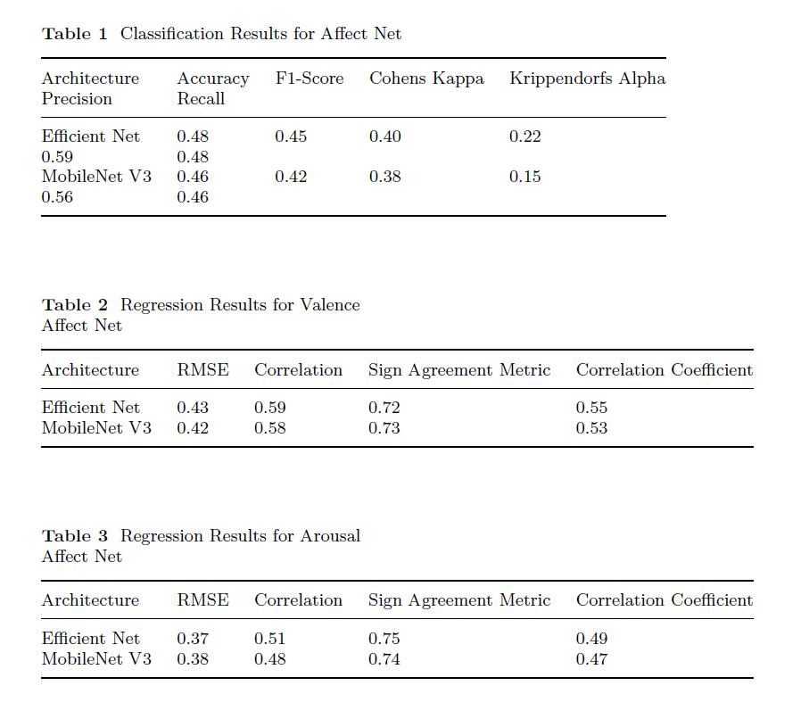
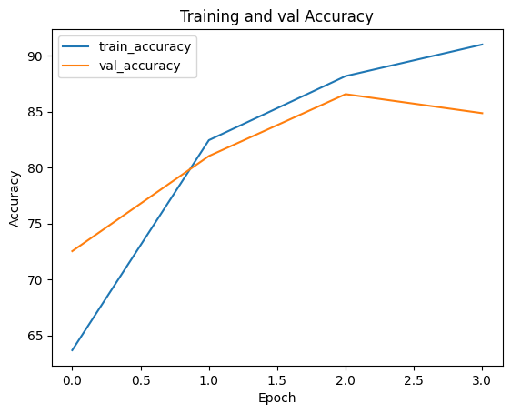
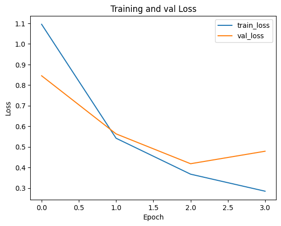

# CV_MSDS_Assignment2
## Syed Saad Ullah Shah
## 400202

### Facial Expression recognition, and computing Valence and Arousal

#### Abstract
Facial expression recognition and valence and arousal prediction are
essential tasks in computer vision with numerous real-world applications.
In this report, we propose a novel approach for facial expression
recognition and valence and arousal prediction using two state-of-theart
CNN architectures, EfficientNet and MobileNet V3, on the AffectNet
dataset. We fine-tuned the pre-trained models to output three values,
i.e., expression, valence, and arousal. Our proposed approach achieved
excellent performance on the AffectNet dataset, surpassing the state-ofthe-
art methods reported in the literature. We evaluated our approach
using categorical accuracy for expression recognition and mean absolute
error (MAE) for valence and arousal prediction. Our results demonstrate
the effectiveness of our proposed approach for facial expression
recognition and valence and arousal prediction, with potential applications
in affective computing, human-computer interaction, and robotics.

#### Results

#### Diagrams

